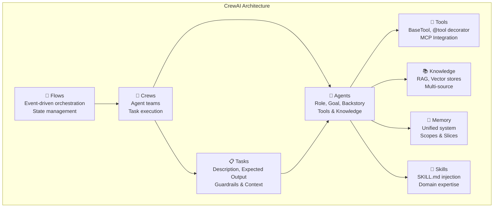
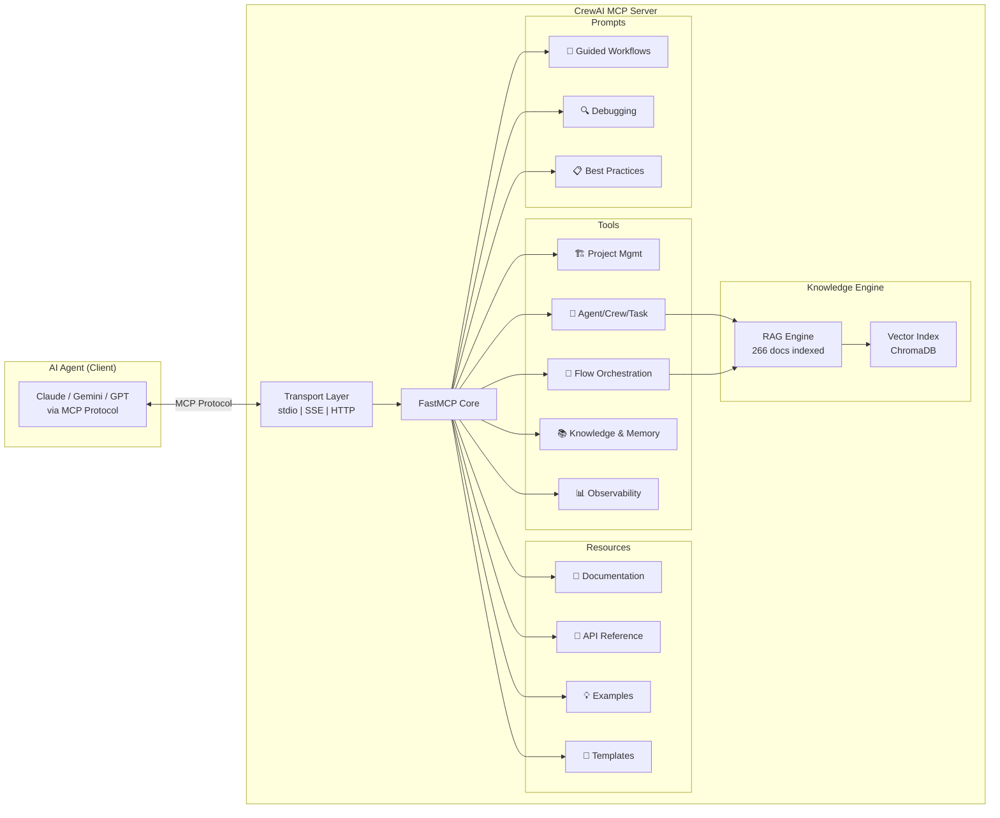

# CrewAI MCP Server — Implementation Plan

> **Objetivo:** Construir un MCP Server que convierta a cualquier agente de IA (Claude, Gemini, GPT, etc.) en un **orquestador maestro de CrewAI**, con acceso a documentación completa, herramientas programáticas, templates, y utilidades de gestión de ciclo de vida.

---

## User Review Required

> [!IMPORTANT]
> **Decisión de Runtime:** El MCP server necesita ejecutar código Python (crear proyectos, instanciar crews, etc.). ¿Deseas que ejecute operaciones directamente en el sistema local, o prefieres un modelo de "generación de código" donde el MCP genera scripts que tú ejecutas manualmente?

> [!IMPORTANT]
> **Alcance LLM:** ¿Qué LLM providers deseas soportar por defecto en los templates generados? (OpenAI, Anthropic, Gemini, Ollama, todos)

> [!WARNING]
> **Dependencia de `crewai`:** El servidor MCP necesita `crewai` y `crewai-tools` como dependencias Python. Esto requiere Python ≥3.10 y <3.14, además de las API keys correspondientes al LLM elegido.

## Open Questions

> [!IMPORTANT]
> 1. **Docker vs Local:** ¿Prefieres desplegar el MCP server en Docker (como tu triad-api actual) o como proceso local vía stdio?
> 2. **Persistencia:** ¿Deseas que el MCP mantenga estado entre sesiones (proyectos creados, crews ejecutados, memorias)?
> 3. **Integración con triad-api:** ¿Quieres que este MCP reemplace al triad-api actual o que coexista?

---

## Background & Architecture Overview

### CrewAI Ecosystem (Resumen de la Documentación)

Tras la revisión exhaustiva de las **266 páginas** de documentación, CrewAI se estructura en:



### MCP Server Architecture



---

## Proposed Changes

### Component 1: Project Foundation

#### [NEW] [pyproject.toml](file:///c:/Users/P0zcl/Desktop/cwai-mcp/pyproject.toml)

Configuración del proyecto Python con `uv`:
- **name:** `crewai-mcp-server`
- **python:** `>=3.10,<3.14`
- **dependencies:** `mcp[cli]>=1.0`, `crewai`, `crewai-tools`, `chromadb`, `pydantic`
- **scripts:** Entry point `crewai-mcp = "crewai_mcp.server:main"`

#### [NEW] [README.md](file:///c:/Users/P0zcl/Desktop/cwai-mcp/README.md)

Documentación de instalación, configuración, y uso con diferentes clientes MCP.

---

### Component 2: MCP Server Core (`src/crewai_mcp/`)

#### [NEW] [server.py](file:///c:/Users/P0zcl/Desktop/cwai-mcp/src/crewai_mcp/server.py)

Punto de entrada principal usando `FastMCP`:

```python
from mcp.server.fastmcp import FastMCP

mcp = FastMCP(
    name="crewai-orchestrator",
    version="1.0.0",
    description="MCP Server for CrewAI orchestration — documentation, tools, and workflow management"
)
```

- Registra todos los recursos, herramientas y prompts
- Soporta transports: stdio (default), SSE, Streamable HTTP
- Configurable via environment variables

#### [NEW] [config.py](file:///c:/Users/P0zcl/Desktop/cwai-mcp/src/crewai_mcp/config.py)

Gestión centralizada de configuración:
- `CREWAI_WORKSPACE`: directorio de trabajo para proyectos CrewAI
- `CREWAI_DOCS_PATH`: ruta a la documentación local (default: `./docs`)
- `CREWAI_DEFAULT_LLM`: modelo LLM por defecto
- `CREWAI_MCP_TRANSPORT`: transporte MCP (stdio/sse/http)

---

### Component 3: MCP Resources — Documentation Engine

#### [NEW] [resources/documentation.py](file:///c:/Users/P0zcl/Desktop/cwai-mcp/src/crewai_mcp/resources/documentation.py)

Expone la documentación scraped como **MCP Resources** con URIs semánticas:

| Resource URI | Descripción | Fuente |
|---|---|---|
| `crewai://docs/concepts/{topic}` | Core concepts (agents, crews, tasks, flows, tools, etc.) | `docs/concepts/*.md` |
| `crewai://docs/learn/{topic}` | Guías prácticas y tutoriales | `docs/learn/*.md` |
| `crewai://docs/mcp/{topic}` | Integración MCP en CrewAI | `docs/mcp/*.md` |
| `crewai://docs/tools/{category}/{tool}` | Documentación de herramientas | `docs/tools/**/*.md` |
| `crewai://docs/api/{section}` | API Reference | `docs/api-reference/*.md` |
| `crewai://docs/guides/{topic}` | Guías avanzadas | `docs/guides/**/*.md` |

**Implementación:**
- Lee archivos `.md` del directorio `docs/`
- Resource templates con parámetros dinámicos
- Cache en memoria para lecturas frecuentes
- Búsqueda semántica via RAG engine

#### [NEW] [resources/templates.py](file:///c:/Users/P0zcl/Desktop/cwai-mcp/src/crewai_mcp/resources/templates.py)

Templates pre-construidos para scaffolding rápido:

| Resource URI | Contenido |
|---|---|
| `crewai://templates/agent/{type}` | Templates: researcher, writer, analyst, coder, reviewer |
| `crewai://templates/crew/{pattern}` | Patterns: sequential, hierarchical, parallel |
| `crewai://templates/flow/{type}` | Flows: linear, branching, router, human-in-loop |
| `crewai://templates/task/{type}` | Tasks: research, analysis, content, code-review |
| `crewai://templates/tool/custom` | Skeleton para herramientas custom |
| `crewai://templates/yaml/{type}` | agents.yaml y tasks.yaml pre-configurados |

---

### Component 4: MCP Tools — CrewAI Orchestration

#### [NEW] [tools/project_management.py](file:///c:/Users/P0zcl/Desktop/cwai-mcp/src/crewai_mcp/tools/project_management.py)

| Tool | Descripción | Parámetros |
|---|---|---|
| `crewai_create_project` | Genera scaffolding de proyecto crew o flow | `name`, `type` (crew\|flow), `llm_provider` |
| `crewai_install_deps` | Ejecuta `crewai install` + dependencias adicionales | `project_path`, `extra_packages[]` |
| `crewai_add_tool` | Agrega una herramienta al proyecto | `project_path`, `tool_name`, `tool_config` |
| `crewai_project_info` | Lee estructura y configuración del proyecto | `project_path` |

#### [NEW] [tools/agent_lifecycle.py](file:///c:/Users/P0zcl/Desktop/cwai-mcp/src/crewai_mcp/tools/agent_lifecycle.py)

| Tool | Descripción | Parámetros |
|---|---|---|
| `crewai_define_agent` | Genera definición YAML + Python de un agente | `role`, `goal`, `backstory`, `tools[]`, `llm`, `options{}` |
| `crewai_define_task` | Genera definición YAML + Python de una tarea | `description`, `expected_output`, `agent`, `context[]`, `guardrails[]`, `output_format` |
| `crewai_define_crew` | Compone una crew con agentes y tareas | `agents[]`, `tasks[]`, `process`, `memory`, `planning`, `options{}` |
| `crewai_kickoff` | Ejecuta una crew con inputs | `project_path`, `inputs{}` |
| `crewai_kickoff_status` | Consulta estado de ejecución | `execution_id` |
| `crewai_get_output` | Recupera resultado de la última ejecución | `project_path`, `format` (raw\|json\|pydantic) |

#### [NEW] [tools/flow_orchestration.py](file:///c:/Users/P0zcl/Desktop/cwai-mcp/src/crewai_mcp/tools/flow_orchestration.py)

| Tool | Descripción | Parámetros |
|---|---|---|
| `crewai_define_flow` | Genera un Flow con state management | `name`, `state_schema{}`, `steps[]`, `options{}` |
| `crewai_add_flow_step` | Agrega un step (@start, @listen, @router) | `flow_name`, `step_name`, `type`, `listens_to`, `logic` |
| `crewai_flow_plot` | Genera visualización del flow | `project_path` |
| `crewai_flow_run` | Ejecuta un flow | `project_path`, `inputs{}` |

#### [NEW] [tools/knowledge_memory.py](file:///c:/Users/P0zcl/Desktop/cwai-mcp/src/crewai_mcp/tools/knowledge_memory.py)

| Tool | Descripción | Parámetros |
|---|---|---|
| `crewai_add_knowledge` | Agrega fuente de conocimiento | `project_path`, `source_type` (string\|file\|pdf\|csv\|json\|web), `content_or_path`, `scope` |
| `crewai_query_knowledge` | Consulta RAG sobre la documentación CrewAI | `query`, `limit`, `filter_topic` |
| `crewai_manage_memory` | Configura/resetea memoria de crews | `project_path`, `action` (configure\|reset\|status), `memory_type`, `options{}` |

#### [NEW] [tools/observability.py](file:///c:/Users/P0zcl/Desktop/cwai-mcp/src/crewai_mcp/tools/observability.py)

| Tool | Descripción | Parámetros |
|---|---|---|
| `crewai_get_logs` | Recupera logs de ejecución | `project_path`, `format` (txt\|json), `tail` |
| `crewai_list_task_outputs` | Lista outputs de la última ejecución | `project_path` |
| `crewai_replay_task` | Replay desde una tarea específica | `project_path`, `task_id` |
| `crewai_test_crew` | Ejecuta tests de la crew | `project_path`, `iterations`, `model` |
| `crewai_train_crew` | Entrena la crew | `project_path`, `iterations`, `filename` |

---

### Component 5: MCP Prompts — Guided Workflows

#### [NEW] [prompts/workflows.py](file:///c:/Users/P0zcl/Desktop/cwai-mcp/src/crewai_mcp/prompts/workflows.py)

| Prompt | Descripción | Argumentos |
|---|---|---|
| `design_crew` | Guía paso a paso para diseñar una crew completa | `use_case`, `complexity` |
| `design_flow` | Diseña un flow con state management | `workflow_description`, `needs_human_review` |
| `debug_crew` | Diagnostica problemas en una crew | `error_message`, `project_path` |
| `optimize_crew` | Sugiere optimizaciones | `project_path`, `metric` (cost\|speed\|quality) |
| `migrate_crew` | Guía de migración entre versiones | `current_version`, `target_version` |
| `select_llm` | Recomienda LLM según caso de uso | `use_case`, `budget`, `requirements` |
| `create_custom_tool` | Guía para crear herramientas custom | `tool_purpose`, `needs_async` |
| `setup_mcp_integration` | Configura integración MCP en un crew | `server_type`, `transport` |

---

### Component 6: RAG Knowledge Engine

#### [NEW] [knowledge/indexer.py](file:///c:/Users/P0zcl/Desktop/cwai-mcp/src/crewai_mcp/knowledge/indexer.py)

Motor de indexación de la documentación:
- Parsea los 266 archivos `.md` de `docs/`
- Chunking inteligente por secciones (headers, code blocks)
- Genera embeddings con modelo configurable
- Almacena en ChromaDB local
- Re-indexación incremental (por hash de archivo)

#### [NEW] [knowledge/retriever.py](file:///c:/Users/P0zcl/Desktop/cwai-mcp/src/crewai_mcp/knowledge/retriever.py)

Motor de búsqueda semántica:
- Búsqueda por similitud vectorial
- Filtrado por categoría/topic
- Reranking por relevancia
- Responde la tool `crewai_query_knowledge`

---

### Component 7: Testing & Quality

#### [NEW] [tests/](file:///c:/Users/P0zcl/Desktop/cwai-mcp/tests/)

- `test_resources.py`: Verifica URIs de recursos, contenido correcto
- `test_tools.py`: Unit tests de cada herramienta
- `test_prompts.py`: Valida estructura de prompts
- `test_knowledge.py`: Tests del motor RAG
- `test_integration.py`: Tests end-to-end con MCP Inspector

---

### Component 8: Deployment Configuration

#### [NEW] [Dockerfile](file:///c:/Users/P0zcl/Desktop/cwai-mcp/Dockerfile)

Multi-stage build:
1. **Build stage:** Instala uv, crewai, dependencias
2. **Runtime stage:** Slim image con server + docs
3. Expone puertos para SSE/HTTP transport
4. Volume mount para workspace de proyectos

#### [NEW] [docker-compose.yml](file:///c:/Users/P0zcl/Desktop/cwai-mcp/docker-compose.yml)

```yaml
services:
  crewai-mcp:
    build: .
    ports:
      - "8808:8808"  # SSE/HTTP transport
    volumes:
      - ./docs:/app/docs          # Documentation
      - ./workspace:/app/workspace  # CrewAI projects
    environment:
      - CREWAI_MCP_TRANSPORT=sse
      - OPENAI_API_KEY=${OPENAI_API_KEY}
```

#### [NEW] [.env.example](file:///c:/Users/P0zcl/Desktop/cwai-mcp/.env.example)

Template de variables de entorno necesarias.

---

## File Structure

```
cwai-mcp/
├── docs/                           # Documentación scraped (ya existe)
│   ├── concepts/
│   ├── learn/
│   ├── mcp/
│   ├── tools/
│   └── ...
├── src/
│   └── crewai_mcp/
│       ├── __init__.py
│       ├── server.py               # FastMCP entry point
│       ├── config.py               # Configuration management
│       ├── resources/
│       │   ├── __init__.py
│       │   ├── documentation.py    # Doc resources
│       │   └── templates.py        # Template resources
│       ├── tools/
│       │   ├── __init__.py
│       │   ├── project_management.py
│       │   ├── agent_lifecycle.py
│       │   ├── flow_orchestration.py
│       │   ├── knowledge_memory.py
│       │   └── observability.py
│       ├── prompts/
│       │   ├── __init__.py
│       │   └── workflows.py
│       └── knowledge/
│           ├── __init__.py
│           ├── indexer.py          # Document indexer
│           └── retriever.py        # Semantic search
├── tests/
│   ├── test_resources.py
│   ├── test_tools.py
│   ├── test_prompts.py
│   ├── test_knowledge.py
│   └── test_integration.py
├── workspace/                      # CrewAI projects workspace
├── pyproject.toml
├── Dockerfile
├── docker-compose.yml
├── .env.example
└── README.md
```

---

## Implementation Phases

### Phase 1: Foundation (Estimado: 2-3h)
- [ ] Setup proyecto Python con pyproject.toml
- [ ] Implementar `server.py` con FastMCP
- [ ] Implementar `config.py`
- [ ] Registrar transports (stdio + SSE)

### Phase 2: Resources (Estimado: 2-3h)
- [ ] Implementar `resources/documentation.py` — indexar docs/
- [ ] Implementar `resources/templates.py` — templates pre-built
- [ ] Verificar con MCP Inspector

### Phase 3: Knowledge Engine (Estimado: 2-3h)
- [ ] Implementar `knowledge/indexer.py` — chunking + embedding
- [ ] Implementar `knowledge/retriever.py` — búsqueda semántica
- [ ] Tool `crewai_query_knowledge` operativo

### Phase 4: Core Tools (Estimado: 4-5h)
- [ ] `tools/project_management.py` — create, install, info
- [ ] `tools/agent_lifecycle.py` — define agents, tasks, crews, kickoff
- [ ] `tools/flow_orchestration.py` — define flows, steps, run
- [ ] `tools/knowledge_memory.py` — add knowledge, manage memory
- [ ] `tools/observability.py` — logs, outputs, replay, test, train

### Phase 5: Prompts (Estimado: 1-2h)
- [ ] `prompts/workflows.py` — 8 guided workflows
- [ ] Vincular prompts con tools relevantes

### Phase 6: Deployment & Testing (Estimado: 2-3h)
- [ ] Dockerfile multi-stage
- [ ] docker-compose.yml
- [ ] Tests unitarios
- [ ] Tests de integración
- [ ] README.md completo

---

## Verification Plan

### Automated Tests
```bash
# Unit tests
uv run pytest tests/ -v

# Lint & type checking
uv run ruff check src/
uv run mypy src/crewai_mcp/
```

### MCP Inspector Validation
```bash
# Launch MCP Inspector against the server
npx @modelcontextprotocol/inspector python -m crewai_mcp.server
```

Verificaciones:
1. ✅ Listar todos los Resources y confirmar URIs
2. ✅ Invocar cada Tool con parámetros válidos
3. ✅ Ejecutar cada Prompt y validar output
4. ✅ Buscar en knowledge base con queries variadas
5. ✅ Crear un proyecto crew completo via tools
6. ✅ Ejecutar un flow end-to-end

### Manual Verification
- Conectar el MCP server a un cliente real (Claude Desktop, Gemini, etc.)
- Ejecutar un workflow completo: diseñar crew → definir agentes → crear tareas → kickoff
- Verificar que la documentación RAG responde con precisión
